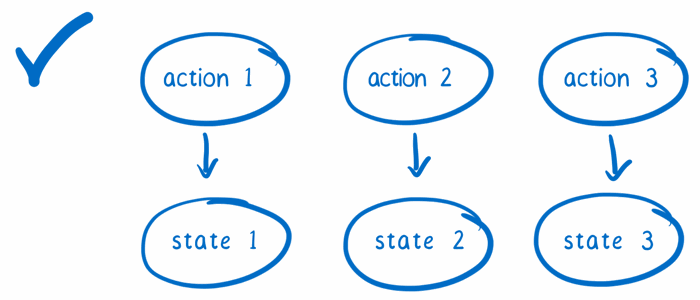

# 揭秘 React 状态管理

[原文地址](https://github.com/happylindz/react-state-management-tutorial)

> 阅读本文之前，希望你掌握 React，ES6 等相关知识

本文所有代码都可以从 github 仓库下载，读者可以:

```
git clone https://github.com/happylindz/react-state-management-tutorial.git
cd react-state-management-tutorial
cd controlxxxx/
npm i 
npm start 
```

React 是 Facebook 提出的前端框架，作为 View 层很好地解决了视图层渲染问题，但是却缺乏有效的状态管理，在构建大型的前端应用就会显得十分乏力时，需要有一个良好的状态管理，如：Flux，Redux，Mobx 等等.

起初在使用的时候我也曾感到疑惑：为什么会有这么多东西，写起来不是更麻烦了吗，对其缺乏系统上的认知，以至于我在工作中用的蹩手蹩脚，最近有空认真地学习了一下其内在思想，希望能够帮助大家理解它们内在的含义。

本文将会介绍一下我对 React 状态管理方案的一些理解，并对 Flux, Rudux, Mobx 等等状态方案进行介绍以及使用。

全文将围绕一个例子 Counter 计数器为线索，并不断优化代码：


从图中可以看出，该例子包含三个计数器和一个总计数器，似乎很轻松，计数器为一个组件，总计数器为另一个组件，然后用一个容器包含三个计数器组件和一个总计数器组件即可。

## 一、父子组件间通信

首先我们先用没有任何状态管理框架来做这个例子，由于总计数器组件的值需要结合三个计数器的值之和，形成联动的效果，根据下面的即可查看效果。

```
cd controlpanel/
npm i 
```

我们知道，父组件给子组件传递信息是通过 props 属性，而子组件给父组件传递信息是通过传递函数，

我把组件放在 view 中，目录结果如下：

```
├── index.js
└── views
    ├── ControlPanel.js
    ├── Counter.js
    └── Summary.js
```

主要代码：

```javascript
export default class ControlPanel extends Component {
	//...
    render() {
        return (
            <div>
                <Counter caption={ 'First' } value={ this.initValues['First'] } onCounterUpdate={ this.onCounterUpdate }   />
                <Counter caption={ 'Second' } value={ this.initValues['Second'] } onCounterUpdate={ this.onCounterUpdate }   />
                <Counter caption={ 'Third' } value={ this.initValues['Third'] } onCounterUpdate={ this.onCounterUpdate }   />
                <Summary value={ this.state.sum }  />
            </div>
        )
    }
}
```

1. 通过 props 向子组件传递信息，如 ``` caption, value ``` 等等字段。
2. 子组件通过父组件定义好的函数将信息放在函数参数中传递给父组件执行，如 ``` onCounterUpdate``` 字段。

值得注意的是，读者可能会好奇，为什么没有这样的 bind 代码？

```javascript
export default class ControlPanel extends Component {
    constructor(props) {
		super(props)
		this.onCounterUpdate = this.onCounterUpdate.bind(this)
    }
}
```

那是因为我在创建类方法的时候使用了箭头函数，在创建该方法的时候 this 已经绑定了类的上下文，所以不用再运行的时候再动态绑定，后面都是按照这种写法，不再赘述。

## 二、结合 MVC 管理

对于像我们这样简单的例子，可能这样就可以结束了，但是试想一下：

1. 对于大型的项目来说，这样的通信方式显然有点拙荆见肘，维护起来将会十分痛苦。
2. 这里刚好只是父子组件的通信，如果嵌套层次较深的组件通信通过这样的方式不够优雅。

所以我们自然而然地想到，可以将这些需要联动的数据抽离出来，形成全局 Model 层，通过一个 Controller 去控制，如下图：


**当计数器增减的时候，View 通知 Controller 更新 Model 数据，之后 Controller 通知所有监听该 Model 数据的 View 视图更新组件。**

```
cd controlpanel_with_mvc/
npm i 
npm start
```

重新改变下目录结构，将这三部分抽离

```
├── controller
│   └── index.js
├── index.js
├── model
│   └── index.js
└── views
    ├── ControlPanel.js
    ├── Counter.js
    └── Summary.js
```


Model 数据：

```javascript
export const counterData = {
    'First': 0,
    'Second': 10,
    'Third': 20,
}
```

Controller 代码：

```javascript
import { counterData } from '../model'

const events = []

const controller = {
    onChange: (callback) => {
        events.push(callback)
    },
    emitChange: () => {
        for(let i = 0; i < events.length; i++) {
            events[i]()
        }
    },
    setCounterValue: (caption, value) => {
        counterData[caption] = value
        controller.emitChange()
    },
    getCounterValue: caption => {
        return counterData[caption]
    },
    getTotalValues: () => {
        let total = 0
        for(let key in counterData) {
            if(counterData.hasOwnProperty(key)) {
                total += counterData[key]                
            }
        }
        return total
    },
}

export default controller
```

创建一个 eventHub，将监听数据的组件的回调函数传入到 events 中，更新输入则通过 controller.setCounterValue 方法，controller 更新数据后通过 emitChange 触发所有监听数据的函数，从而更新视图。

新的 Counter 组件：Counter 保存着全局 Model 数据与自己组件相关数据的映射，在 componentDidMount 执行时，将 onCounterUpdate 传入 events 队列中，即当数据发生变化时候同步保持局部数据与全局数据的一致性，从而形成联动效果。

```javascript
import controller from '../controller'
export default class Counter extends Component {
	//...
	onHandleClickChange = (isIncrement) => {
        const { caption } = this.props
        let value = isIncrement ? this.state.value + 1 : this.state.value - 1
        controller.setCounterValue(caption, value)
    }

    onCounterUpdate = () => {
        const { caption } = this.props
        this.setState({
            value: controller.getCounterValue(caption)
        })
    }
    
    componentDidMount() {
        controller.onChange(this.onCounterUpdate)
    }
}
```

现在父组件完成成为一个容器组件，数据与逻辑已经抽离出来了 View 层。

```javascript
import controller from '../controller'

export default class ControlPanel extends Component {
    render() {
        return (
            <div>
                {
                    controller.getDataKeys().map(caption => (<Counter key={ caption } caption={ caption } />))
                }
                <Summary />
            </div>
        )
    }
}
```

现在如果你想添加计数器只需要在 Model 层添加一个 ```Fourth: 30``` 字段即可。

MVC 的缺陷：上述的 MVC(View、Model、Controller 是1:1:1的关系)只是一种理想状态。现实中的程序往往是多视图，多模型。更严重的是视图与模型之间还可以是多对多的关系。也就是说，单个视图的数据可以来自多个模型，单个模型更新是需要通知多个视图，用户在视图上的操作可以对多个模型造成影响。

试想一下：当你再不经意间将数据设为 null 时，之前的数据将直接被你覆盖掉了，你没有对数据改变进行严格的控制。

```javascript
import controller from '../controller'
export default class Counter extends Component {
	//...
	onHandleClickChange = (isIncrement) => {
        const { caption } = this.props
        let value = isIncrement ? this.state.value + 1 : this.state.value - 1
        controller.setCounterValue(caption, null)
    }
}
```

另外，在实际框架实现中，总允许 View 和 Model 可以直接通信，当代吗量增大之后，我们的应用将会变得：


当出现多模型多视图，在 MVC 中让 View 和 Model 直接通信简直就是灾难。

## Flux 架构

为此，Facebook 提出了 Flux 架构，提供更加严格的数据流控制，说白了就是让你无法直接修改数据，为所欲为了。


一个 Flux 应用包含四个部分：

* Dispatcher，处理动作的分发，修改 Store 上的数据
* Store，负责存储数据和处理数据相关的逻辑
* Action，驱动 Dipatcher 的 JS 对象
* VIew，视图部分，展示数据

可以看出，Action 是事先定义好的动作，比如：计数器增减操作，除此之外，用户无法通过其他方式直接对数据进行修改。当用户触发事件，通过 Dipatcher 将 Action 分发，Store 接收并处理 Action 对象，所以计数器例子我们就可以进行修改了。

```javascript
cd controlpanel_with_flux/
npm i 
npm start
```

目录结构：

```
├── actionCreator
│   └── index.js
├── actionTypes
│   └── index.js
├── dispatch
│   └── index.js
├── index.js
├── store
│   ├── CounterStore.js
│   └── SummaryStore.js
└── views
    ├── ControlPanel.js
    ├── Counter.js
    └── Summary.js
```

actionTypes 用于定义 Action 类型，通常暴露一下常量给组件使用，比如这里我们需要两个 Action 类型：增加、减少计数值。

```javascript
export const INCREMENT = 'INCREMENT'
export const DECREMENT = 'DECREMENT'
```

actionCreator 用于创建 action 函数，暴露出 Action 函数给组件使用，函数内分发 action 对象给 dispatcher 使用。

```javascript
import * as actionTypes from '../actionTypes'
import AppDispatcher from '../dispatch'

export default {
    increment: (counterCaption) => {
        AppDispatcher.dispatch({
            type: actionTypes.INCREMENT,
            counterCaption: counterCaption,
        })
    },
    decrement: (counterCaption) => {
        AppDispatcher.dispatch({
            type: actionTypes.DECREMENT,
            counterCaption: counterCaption,
        })
    }
}
```

store 取代了 Model 层以及部分 Controller 的逻辑，

```javascript
const counterData = {
    'First': 0,
    'Second': 10,
    'Third': 20,
}

const events = []

const CounterStore = {
    incrementCounter: caption => {
        counterData[caption]++
    },
    decrementCounter: caption => {
        counterData[caption]--
    },
    onChange: callback => {
        events.push(callback)
    },
    emitChange: () => {
        for(let i = 0; i < events.length; i++) {
            events[i]()
        }
    },
    getDataKeys: () => {
        return Object.keys(counterData)
    },
    getCounterValue: caption => {
        return counterData[caption]
    },
    getCounterKeys: () => {
        return Object.keys(counterData)
    },
}


export default CounterStore
```

这时候发送方和接收方都已经定义好了，就差 dispatcher 这个中间桥梁来传递数据了。

```javascript
import { Dispatcher } from 'flux'
import * as actionTypes from '../actionTypes'
import CounterStore from '../store/CounterStore'

const dispatcher = new Dispatcher()

CounterStore.dispatchToken = dispatcher.register((action) => {
    switch(action.type) {
        case actionTypes.INCREMENT:
            CounterStore.incrementCounter(action.counterCaption)
            CounterStore.emitChange()
            break
        case actionTypes.DECREMENT:
            CounterStore.decrementCounter(action.counterCaption)
            CounterStore.emitChange()
            break
        default:
            break
    }
})
```

通过 dispatcher.register 来出来视图发出的 action 对象，这时候 actionTypes 就派上用场，设置这种全局的变量可以减少一些硬编码量，减低犯错的可能。

从上述的代码可以看出，通过判断 action.type 值来进行不同的操作，但是能操作的可能只有增加或减少数值，其他类型的 action 均为无效操作，这样就限制了数据发生异常的可能。

当更新了数据后，同样触发监听数据的回调函数，让监听数据的组件将全局变量同步更新到局部的状态，从而触发视图的刷新，这部分逻辑就跟 MVC 上的一模一样了。

另外将原本的 controller 拆分成两个 Store (CounterStore & SummaryStore)，这样可以做更加细粒度的控制(即可以分开添加回调函数)，详细代码可以看 SummaryStore 和 dispatch，这里不再详细展开。

Flux 优点：

1. React 组价依然有自己的状态，但是已经完全沦为 Store 数据的一个映射，而不是主动变化数据
2. 对数据有着更加严格的控制，不允许直接对数据进行修改，数据更加不容易出错。
3. 遵循严格的单向数据流，想要追溯一个应用的逻辑变得非常容易，更加容易进行维护。

Flux 缺点：

参考：[《看漫画，学 Redux》 —— A cartoon intro to Redux](https://github.com/jasonslyvia/a-cartoon-intro-to-redux-cn)

1. store 的代码无法被热替换，除非清空当前的状态
2. 每次触发 action 时状态对象都被直接改写了
3. 没有合适的位置引入第三方插件
4. 难以进行服务端渲染

问题 1：Store 混淆了逻辑和状态，当我们需要动态替换一个 Store 的逻辑时，只能把这个 Store 整体替换掉，那也就无法保持 Store 中的存储状态。


在一个 store 中同时保存这两样东西将会导致代码热替换功能出现问题。当你热替换掉 store 的代码想要看看新的状态改变逻辑是否生效时，你就丢失了 store 中保存的当前状态。


#### 解决方案：

将这两样东西分开处理。让一个对象来保存状态，这个对象在热替换代码的时候不会受到影响。让另一个对象包含所有改变状态的逻辑，这个对象可以被热替换因为它不用关心任何保存状态相关的事情。


问题 2：时间旅行调试法的特性是：你能掌握状态对象的每一次变化，这样的话，你就能轻松的跳回到这个对象之前的某个状态（想象一个撤销功能）。


所以要想实现时间旅行特性，每一个状态改变的版本都需要保存在不同的 JavaScript 对象中，这样你才不会不小心改变了某个历史版本的状态。

#### 解决方案:

当一个 action 需要 store 响应时，不要直接修改 store 中的状态，而是将状态拷贝一份并在这份拷贝的状态上做出修改，这样方便对 store 状态进行调试回滚。



问题 3：没有合适的位置引入第三方插件

一个简单的例子就是日志。比如说你希望 console.log() 每一个触发的 action 同时 console.log() 这个 action 被响应完成后的状态。在 Flux 中，你只能订阅（subscribe） dispatcher 的更新和每一个 store 的变动。但是这样就侵入了业务代码，这样的日志功能不是一个第三方插件能够轻易实现的。

不好的：这样做就入侵了代码

```javascript
const dispatcher = new Dispatcher()

CounterStore.dispatchToken = dispatcher.register((action) => {
	console.log(action);
   	switch(action.type) {
		//...
   }
})
```

我们希望以一种插件的方式来引入，比如：

```javascript
import logger from 'xxx-logger'
const dispatcher = new Dispatcher({ plugins:[ logger ] }) // something like this

CounterStore.dispatchToken = dispatcher.register((action) => {
   	switch(action.type) {
		//...
   }
})
```

#### 解决方案:

在架构原有的功能基础之上添加了自己的功能。你可以把这种扩展点看做是一个增强器（enhancers）或者高阶对象（higher order objects），亦或者中间件（middleware）。


当 dispatch 获取到 action 和 state 之后，通过层层中间件处理，最后生成新的状态，可以将 logger 日志功能看成一个中间件。

## Redux 架构


